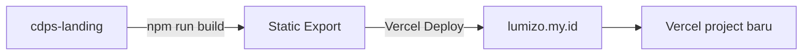

# CDPS Landing Page + Demo Dashboard — Plan Implementasi

## Ringkasan

Buat project **Next.js baru** di `D:\cdps-landing\` untuk landing page Lumizo/CDPS dan demo dashboard.
Project terpisah dari `web-iis` (portal IIS PSM), beda brand, beda domain (`lumizo.my.id`).

```
D:\
├── web-iis\           ← Portal IIS PSM (tidak disentuh)
└── cdps-landing\      ← Project baru: landing + demo
```

---

## Arsitektur

### Stack
| Teknologi | Versi |
|-----------|-------|
| Next.js | 16 (App Router) |
| TypeScript | 5.x |
| Tailwind CSS | 4 |
| Deployment | Vercel → `lumizo.my.id` |

### Karakteristik
- **100% statis** — no database, no auth, no API routes
- **Client components** untuk interaksi (sidebar, lightbox, tabs)
- **Server components** untuk halaman statis (landing page sections)
- **Data dummy hardcoded** di `app/demo/lib/data.ts`

### Routing

```
lumizo.my.id
├── /                        → Landing page CDPS
├── /demo                    → Dashboard demo
├── /demo/daily-report       → Contoh daily report
├── /demo/portofolio         → Contoh portofolio
├── /demo/laporan            → Contoh laporan triwulan
└── (semua halaman statis, SSG)
```

---

## Struktur File

```
cdps-landing/
├── app/
│   ├── globals.css              ← CSS Tailwind + theme vars
│   ├── layout.tsx               ← Root layout (metadata, font, SEO)
│   ├── page.tsx                 ← Landing page
│   ├── demo/
│   │   ├── layout.tsx           ← Demo layout (sidebar + topbar)
│   │   ├── page.tsx             ← Dashboard overview
│   │   ├── daily-report/
│   │   │   └── page.tsx         ← Daily report detail
│   │   ├── portofolio/
│   │   │   └── page.tsx         ← Portofolio view
│   │   ├── laporan/
│   │   │   └── page.tsx         ← Laporan triwulan
│   │   └── lib/
│   │       └── data.ts          ← Generator data dummy
│   └── not-found.tsx            ← 404 page
├── public/
│   ├── logo.svg                 ← Logo Lumizo/CDPS
│   └── og-image.png             ← OG image untuk social media
├── components/
│   ├── landing/
│   │   ├── Hero.tsx
│   │   ├── Features.tsx
│   │   ├── ForWho.tsx
│   │   ├── HowItWorks.tsx
│   │   ├── DemoPreview.tsx
│   │   ├── FAQ.tsx
│   │   └── Footer.tsx
│   └── demo/
│       ├── Sidebar.tsx           ← Sidebar navigasi (seperti asli)
│       ├── Topbar.tsx            ← Topbar mobile
│       ├── StatCard.tsx          ← Kartu statistik
│       ├── ReportCard.tsx        ← Kartu daily report
│       └── PortfolioCard.tsx     ← Kartu portofolio
├── tailwind.config.ts
├── next.config.ts
├── tsconfig.json
├── package.json
└── README.md
```

**Total: ~25 file**

---

## Detail Per Bagian

### 1. Landing Page (`app/page.tsx` + `components/landing/`)

Konsep: "CDPS — All-in-One Child Development Portal by Lumizo"

| Section | Konten | Visual |
|---------|--------|--------|
| **Hero** | Headline: "Pantau Tumbuh Kembang Anak Lebih Mudah" + sub-headline + CTA "Coba Demo Gratis" | Background gradasi + ilustrasi figur anak |
| **Fitur** | 6 fitur: Daily Report, Portofolio Digital, Laporan Perkembangan, CCTV Live, Absensi Guru, Notifikasi | Grid 3×2 dengan icon + deskripsi singkat |
| **Untuk Siapa** | 3 kolom: Sekolah, Guru, Orang Tua — masing-masing beda benefit | Card dengan icon |
| **How It Works** | 3 langkah: 1. Daftar Sekolah → 2. Input Data → 3. Pantau via Portal | Step cards dengan angka |
| **Demo Preview** | Screenshot dashboard + tombol "Lihat Demo Lengkap" | Gambar + overlay |
| **FAQ** | 5-6 pertanyaan umum seputar CDPS | Accordion |
| **Footer** | Brand Lumizo + navigasi + kontak | Single column, clean |

**TIDAK** memuat konten spesifik IIS PSM (fitrah curriculum, sensory integration, alamat Magetan, dll).

### 2. Dashboard Demo (`app/demo/page.tsx` + layout)

**Layout demo** (`demo/layout.tsx`):
- Sidebar: Logo CDPS + navigasi (Dashboard, Daily Report, Portofolio, Laporan, CCTV — CCTV link disabled dengan label "Segera")
- Topbar: Nama sekolah dummy "TK Pelita Harapan" + avatar user "Bpk. Ahmad"
- Main content area
- **Mirip** dengan layout asli IIS PSM, tapi dengan brand CDPS

**Halaman Dashboard** (`demo/page.tsx`):
- Statistik: 48 Siswa Aktif, 128 Laporan Bulan Ini, 256 Portofolio, 12 Guru
- Grafik aktivitas (batang sederhana, CSS-only, tanpa chart library)
- Daily report terbaru (3 cards)
- Portofolio terbaru (3 cards)
- Tombol "Lihat Semua" → navigasi ke halaman masing-masing

### 3. Demo Daily Report (`demo/daily-report/page.tsx`)

- List 8 daily report dari 3 siswa dummy
- Masing-masing: nama siswa, tanggal, mood, kehadiran, aktivitas
- Klik → expand detail (makan, tidur, ibadah, observasi)
- Data hardcoded di `data.ts`

### 4. Demo Portofolio (`demo/portofolio/page.tsx`)

- 4 portofolio entries dengan 2-3 foto masing-masing
- Foto dari picsum.photos (dummy image service)
- Grid responsive (2 kolom mobile, 3 desktop)
- Fitur klik foto → lightbox (modal besar) — reuse dari Lightbox.tsx di web-iis

### 5. Demo Laporan (`demo/laporan/page.tsx`)

- 1 laporan triwulan untuk "Aisyah (3th)"
- Tabel penilaian 8 fitrah dengan capaian (BSB/BSH/MB/BB)
- Catatan umum + rekomendasi
- Layout tabel responsive (scroll horizontal di mobile)

### 6. Data Dummy (`demo/lib/data.ts`)

Export konstanta:
- `DEMO_SCHOOL` — nama, logo, alamat (fiktif)
- `DEMO_STUDENTS` — 3 siswa (Aisyah, Budi, Citra)
- `DEMO_TEACHERS` — 2 guru
- `DEMO_DAILY_REPORTS` — 8 report
- `DEMO_PORTOFOLIO` — 4 portofolio dengan array foto URL
- `DEMO_LAPORAN` — 1 laporan triwulan
- `DEMO_STATS` — statistik dashboard
- `DEMO_CAPAIAN` — label capaian

Semua data fiktif, tidak terkait IIS PSM.

---

## Yang TIDAK Ada di Demo

| Fitur | Alasan |
|-------|--------|
| Login / Auth | Butuh Supabase, demo tanpa backend |
| CCTV | Butuh stream URL asli |
| Absensi | Butuh geolokasi + API |
| CRUD Data Siswa | Demo read-only |
| Form Input (report, portofolio, dll) | Demo read-only |
| Pengumuman | Kurang relevan untuk demo |
| Skrining KPSP | Fitur spesifik, tidak untuk umum |

---

## Tahapan Implementasi

### Step 1: Bootstrap Project
- `npx create-next-app@latest cdps-landing --typescript --tailwind --eslint`
- Install dependencies: `clsx`, `lucide-react` (ikon)
- Setup `next.config.ts` + `tailwind.config.ts`
- Setup `globals.css` dengan tema CDPS/Lumizo
- Setup font (Nunito + Fredoka atau pilih yang baru)

### Step 2: Data Dummy + Library
- Buat `app/demo/lib/data.ts`
- Semua data dummy hardcoded

### Step 3: Landing Page
- Hero section
- Features grid
- ForWho section
- HowItWorks
- DemoPreview
- FAQ accordion
- Footer

### Step 4: Demo Layout
- `app/demo/layout.tsx` dengan sidebar navigasi
- `components/demo/Sidebar.tsx`
- `components/demo/Topbar.tsx`

### Step 5: Demo Dashboard
- `app/demo/page.tsx`
- Stat cards
- Grafik aktivitas
- Recent reports + portfolios

### Step 6: Demo Daily Report
- `app/demo/daily-report/page.tsx`
- List report + expand detail

### Step 7: Demo Portofolio
- `app/demo/portofolio/page.tsx`
- Grid foto + lightbox

### Step 8: Demo Laporan
- `app/demo/laporan/page.tsx`
- Tabel fitrah responsive

### Step 9: 404 + Polish
- `app/not-found.tsx`
- Responsive testing
- SEO metadata

---

## Deployment Plan



1. Push ke GitHub repo baru
2. Import ke Vercel sebagai project terpisah
3. Setup domain `lumizo.my.id` di Vercel
4. Deploy

---

## Catatan

- Project ini **tidak** terhubung ke Supabase atau database apapun
- Semua gambar landing page pakai SVG/icon component, bukan dari storage
- Landing page bisa di-cache penuh (100% static)
- Demo dashboard client-side rendered (CSR) — Next.js tetap bisa generate static shell
- Nanti saat SaaS jadi, project ini bisa digabung atau tetap terpisah sebagai marketing site
